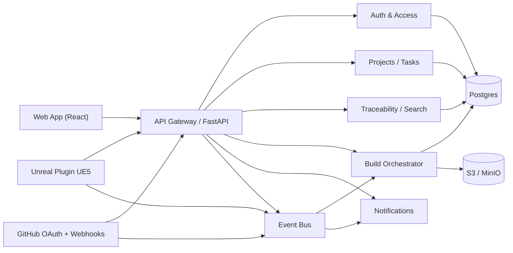

# Arquitectura de alto nivel

## Objetivo

Diseñar una base desacoplada para un SaaS que conecte trabajo de produccion de juegos entre tareas, codigo, assets y builds.

## Componentes

## Decisiones iniciales

- API principal con FastAPI para iterar rapido y definir contratos tipados.
- Frontend SPA con React + Vite.
- Plugin Unreal separado pero alineado con el contrato HTTP del backend.
- Arquitectura modular desde el inicio aunque el despliegue del MVP pueda ser un solo servicio.
- Persistencia preparada para Postgres y object storage, con implementacion in-memory para acelerar el sprint 1.
- Persistencia local del sprint 1.5 con SQLite para timeline, notificaciones, builds y cola de eventos.

## Dominios

- `auth`: usuarios, equipos, membresias, roles, sesiones.
- `projects`: proyectos, epics, tareas, estados y asignaciones.
- `integrations.github`: OAuth, repos, webhooks, commits, PRs.
- `integrations.unreal`: tokens del plugin, metadata de assets, snapshots.
- `builds`: builds, logs, artifacts, estado por task o PR.
- `traceability`: timeline, vinculaciones, busqueda.

## Flujo de trazabilidad MVP

1. Usuario entra con GitHub.
2. Crea un proyecto y una tarea.
3. Unreal Plugin envia metadata de un asset y lo vincula a la tarea.
4. GitHub webhook informa un push o PR y la plataforma agrega commits/PRs a la misma tarea.
5. Desde la tarea se dispara un build y el resultado queda visible en timeline.

## Seguridad e integraciones

- OAuth de GitHub con `state` persistido y canje de `code` por token en backend.
- Secretos gestionados por entorno local `.env` con contrato listo para migrar a secret manager.
- Webhooks de GitHub verificados con HMAC SHA-256.
- Tokens revocables del plugin de Unreal para autenticacion por proyecto.

## Event bus y persistencia

- `event_queue` persiste trabajos asincronos para builds y notificaciones.
- Worker en proceso consume la cola y actualiza estados de build.
- `timeline` y `notifications` quedan persistidos aunque se reinicie la app.

## Riesgos y mitigaciones tempranas

- OAuth y webhooks reales requieren secretos: usar gestor de secretos y rotacion desde el inicio.
- Payloads de Unreal pueden crecer: separar metadata JSON de bundles binarios.
- Busqueda por trazabilidad puede degradarse: preparar indices por `task_id`, `commit_hash`, `asset_guid`.
- Estudios pequenos suelen usar monorepo: modelar `repo_mappings` desde el comienzo.
